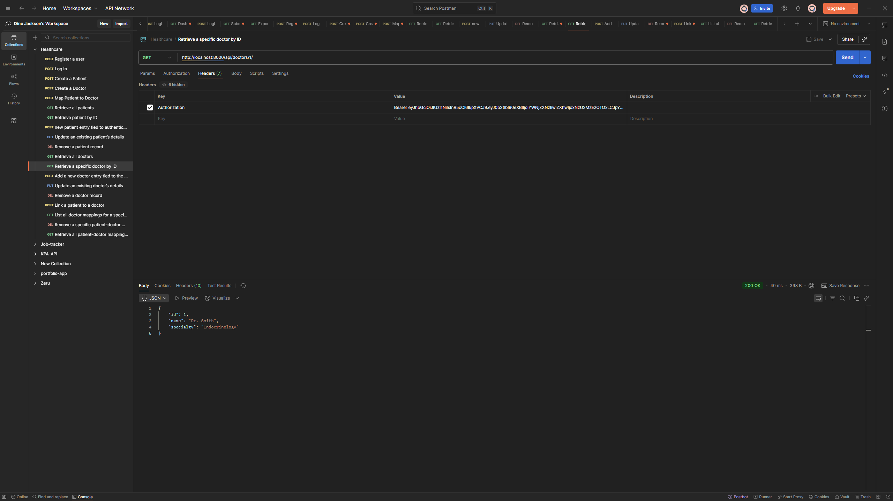

# 🏥 Healthcare Backend — Django + DRF + PostgreSQL


A secure, modular backend system for managing patients, doctors, and their relationships. Built with Django REST Framework, PostgreSQL, and JWT authentication.

---

## 🚀 Features

- ✅ User registration and login with JWT
- ✅ Authenticated CRUD for patients and doctors
- ✅ Patient-doctor mapping system
- ✅ PostgreSQL-backed persistence
- ✅ Secure environment variable handling
- ✅ Modular, spec-driven architecture

---

## 🛠️ Tech Stack

| Tool | Purpose |
|------|--------|
| Django + DRF | Backend framework & REST APIs |
| PostgreSQL | Relational database |
| SimpleJWT | JWT-based authentication |
| Python-dotenv | Environment variable management |
| Postman | API testing |

---

## 📦 Setup Instructions

1. **Clone the repo**
   ```bash
   git clone <your-repo-url>
   cd healthcare_backend
   ```

2. **Create virtual environment**
   ```bash
   python -m venv .venv
   source .venv/bin/activate  # Windows: .venv\Scripts\activate
   ```

3. **Install dependencies**
   ```bash
   pip install -r requirements.txt
   ```

4. **Configure environment variables**
   Create a `.env` file in the root:
   ```env
   SECRET_KEY=your_secret_key
   DEBUG=True
   DATABASE_NAME=your_db_name
   DATABASE_USER=your_db_user
   DATABASE_PASSWORD=your_db_password
   ```

5. **Apply migrations**
   ```bash
   python manage.py makemigrations
   python manage.py migrate
   ```

6. **Run the server**
   ```bash
   python manage.py runserver
   ```

---

## 🔐 Authentication

Use JWT tokens for all protected endpoints.

- Register: `POST /api/auth/register/`
- Login: `POST /api/auth/login/` → returns access & refresh tokens

Include token in headers:
```http
Authorization: Bearer <access_token>
```

---

## 📚 API Endpoints

### 👤 Auth
- `POST /api/auth/register/`
- `POST /api/auth/login/`

### 🧑‍⚕️ Patients
- `POST /api/patients/`
- `GET /api/patients/`
- `GET /api/patients/<id>/`
- `PUT /api/patients/<id>/`
- `DELETE /api/patients/<id>/`

### 👨‍⚕️ Doctors
- `POST /api/doctors/`
- `GET /api/doctors/`
- `GET /api/doctors/<id>/`
- `PUT /api/doctors/<id>/`
- `DELETE /api/doctors/<id>/`

### 🔗 Mappings
- `POST /api/mappings/`
- `GET /api/mappings/`
- `GET /api/mappings/<patient_id>/`
- `DELETE /api/mappings/<id>/`

---

## 📁 Project Structure

```
healthcare_backend/
├── config/         # Django settings and root URLs
├── users/          # User registration, login, JWT auth
├── patients/       # Patient models, views, serializers
├── doctors/        # Doctor models, views, serializers
├── mappings/       # Patient-doctor relationship logic
├── .env            # Environment variables
├── manage.py       # Django entry point
└── README.md       # Project documentation
```

---

## 🧪 Testing

Use Postman or any API client to test endpoints.  
Ensure JWT token is included in headers for protected routes.

###  Postman Collection & Screenshot

A full Postman collection is included for testing all endpoints.

- 📁 File: [`assets/healthcare_backend.postman_collection`](assets/healthcare_backend.postman_collection)
- 📸 Screenshot below shows a successful JWT-authenticated request to a protected endpoint.
: 

To use:
1. Import the JSON file into Postman
2. Set your JWT token in the environment or headers
3. Run requests directly — all endpoints are preconfigured

## 🧠 Author

**Dino Jackson**  
Aspiring backend/cloud developer focused on Django, FastAPI, and deployment architecture. Passionate about clean code, reproducibility, and spec-driven development.

---
